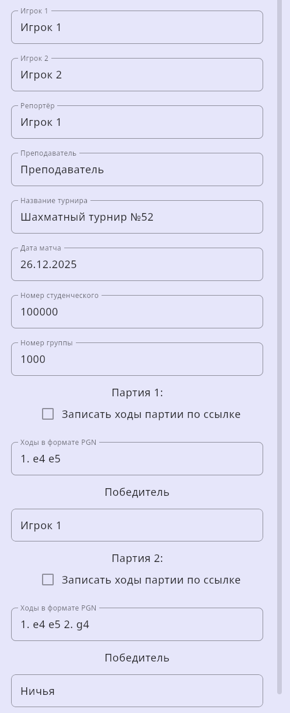
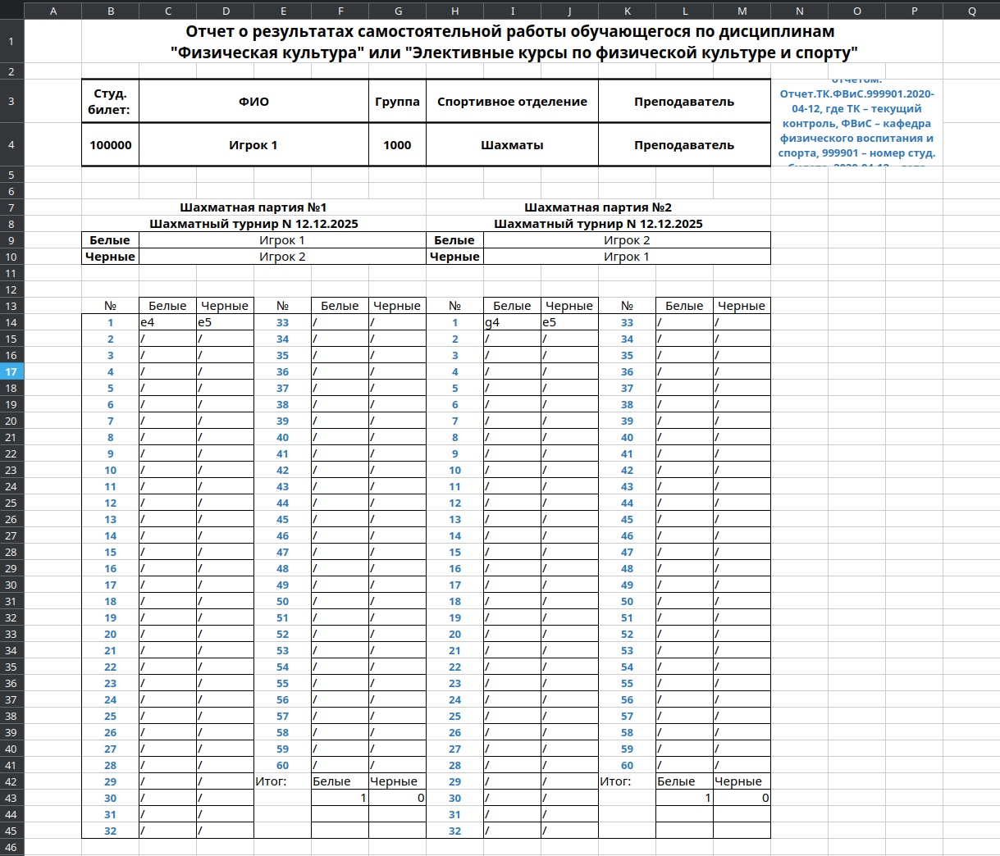
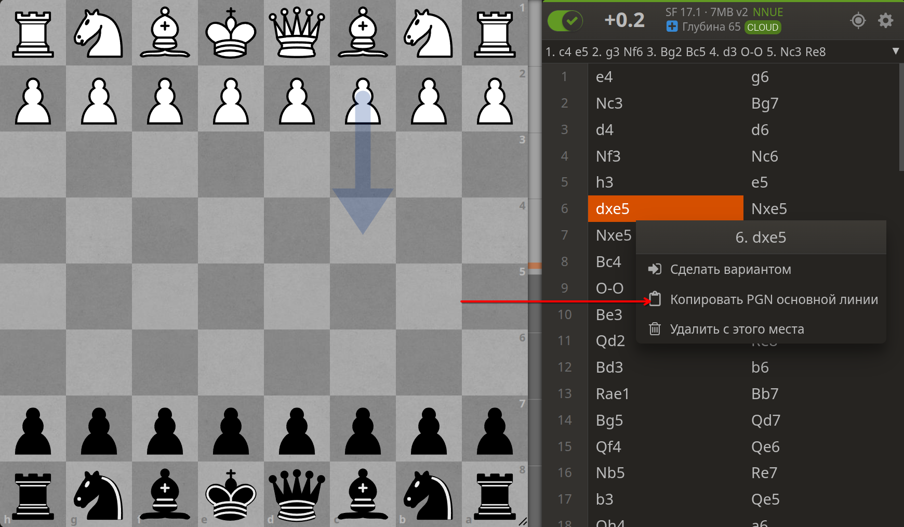
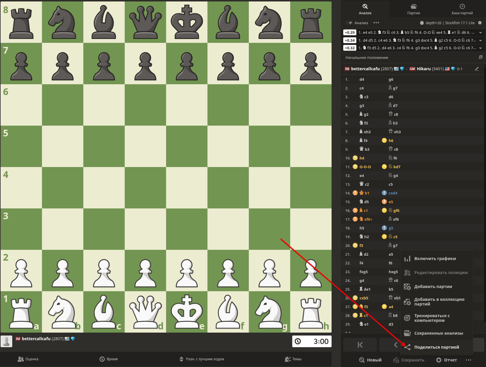
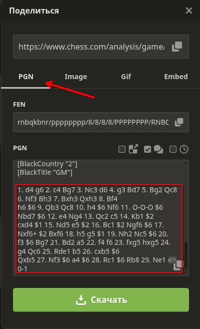

# Chess Report

Десктопное приложение для автоматической генерации шахматных отчётов по итогам матча из двух партий в определённом формате.

Интерфейс: ввод PGN

Интерфейс: PGN и ссылка Lichess

Пример отчёта

## Возможности

- ♟️ **Генерация отчётов в виде таблицы:** Создавайте отчёты о шахматных матчах с определённым форматированием.
- 📋 **Вставка PGN:** Просто скопируйте PGN партий с популярных сайтов, таких как [Lichess.org](https://lichess.org/) и [Chess.com](https://www.chess.com/).
- 🔗 **Парсинг Lichess по ссылке:** Загружайте ходы партии напрямую с Lichess.org, просто вставив URL анализа.
- 🎨 **Автозаполнение данных:** Приложение автоматически парсит PGN и заполняет информацию о партиях.
- 📈 **Автоматическое расширение таблиц:** Таблицы для записи ходов автоматически увеличиваются при необходимости.
- 🖥️ **Кросс-платформенность:** Работает на Windows, macOS и Linux.
- 📂 **Удобный доступ:** Быстро открывайте папку с готовым отчётом прямо из приложения.

## Быстрый старт

1.  **Установите приложение** на ваш компьютер.
2.  **Получите данные о партиях**, используя один из способов ниже.

    

    
Способ 1: Копирование PGN вручную

    Этот способ работает для любого шахматного сайта, включая [Lichess.org](https://lichess.org/) и [Chess.com](https://www.chess.com/).

    1.  На странице завершённой партии найдите и скопируйте PGN.

        *Как скопировать PGN с Lichess.org*
        

        *Как скопировать PGN с Chess.com*
        
        
    2. Вставьте скопированный PGN в соответствующее текстовое поле в приложении.
    > **Важно:** PGN должен содержать только последовательность ходов (например, `1. e4 e5 2. g4 g5 ...`), без метаинформации, комментариев или фигурных скобок.

    

    

    
Способ 2: Автоматическая загрузка с Lichess.org

    Вы можете просто вставить ссылку на партию, и приложение само загрузит все данные.

    1.  На Lichess откройте страницу **анализа партии**.
    2.  Скопируйте URL из адресной строки вашего браузера.
    3.  Вставьте эту ссылку в соответствующее текстовое поле в приложении.

    > **⚠️ Важные замечания:**
    > *   Нужна ссылка именно со страницы **анализа**, а не просто ссылка на партию.
    > *   Ссылка должна быть в формате `https://lichess.org/GAME_ID`. Ссылки, заканчивающиеся на `/white` или `/black`, **не сработают**.
    > *   **Ограничение Lichess:** При большом количестве запросов за короткое время Lichess может временно заблокировать доступ с вашего IP-адреса. Используйте эту функцию умеренно.

    

3.  **Заполните остальные данные** для генерации отчёта:
    - **Игрок 1:** Тот, кто играл первую партию белыми, а вторую — чёрными.
    - **Игрок 2:** Тот, кто играл первую партию чёрными, а вторую — белыми.

4.  Нажмите кнопку **`Сгенерировать отчёт`**.
5.  После создания отчёта нажмите **`Открыть папку с отчётом`**, чтобы просмотреть результат.

## Участие в разработке

Мы будем рады вашему вкладу! Если у вас есть идеи по улучшению приложения или вы нашли ошибку, пожалуйста, создайте `issue` или `pull request`.

И не забудьте поставить ⭐ репозиторию, если вам понравился проект!

## Лицензия

Проект распространяется под лицензией [MIT](LICENSE).
