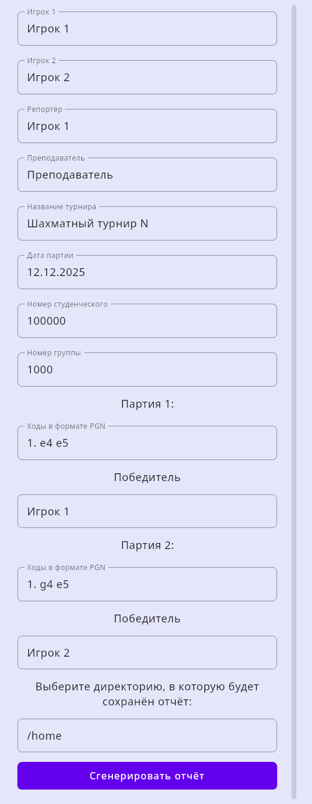

# Chess Report

Десктопное приложение для автоматической генерации шахматных отчётов по итогам матча из двух партий в определённом формате.

Главный экран

Пример отчёта

## Возможности

- ♟️ **Генерация отчётов в виде таблицы:** Создавайте отчёты о шахматных матчах с определённым форматированием.
- 📋 **Вставка PGN:** Просто скопируйте PGN партий с популярных сайтов, таких как [Lichess.org](https://lichess.org/) и [Chess.com](https://www.chess.com/).
- 🎨 **Автозаполнение данных:** Приложение автоматически парсит PGN и заполняет информацию о партиях.
- 🖥️ **Кросс-платформенность:** Работает на Windows, macOS и Linux.
- 📂 **Удобный доступ:** Быстро открывайте папку с готовым отчётом прямо из приложения.

## Быстрый старт

1.  **Установите приложение** на ваш компьютер.
2.  **Скопируйте PGN** двух партий матча с вашего шахматного сайта.

    

    
Как скопировать PGN с Lichess.org

    
    

    

    
Как скопировать PGN с Chess.com

    
    
    

3.  **Заполните данные** для генерации отчёта:
    - **Игрок 1:** Тот, кто играл первую партию белыми, а вторую — чёрными.
    - **Игрок 2:** Тот, кто играл первую партию чёрными, а вторую — белыми.
    - Вставьте PGN партий в соответствующие поля.

4.  Нажмите кнопку **`Сгенерировать отчёт`**.
5.  После создания отчёта нажмите **`Открыть папку с отчётом`**, чтобы просмотреть результат.

## Участие в разработке

Мы будем рады вашему вкладу! Если у вас есть идеи по улучшению приложения или вы нашли ошибку, пожалуйста, создайте `issue` или `pull request`.

И не забудьте поставить ⭐ репозиторию, если вам понравился проект!

## Лицензия

Проект распространяется под лицензией [MIT](LICENSE).

